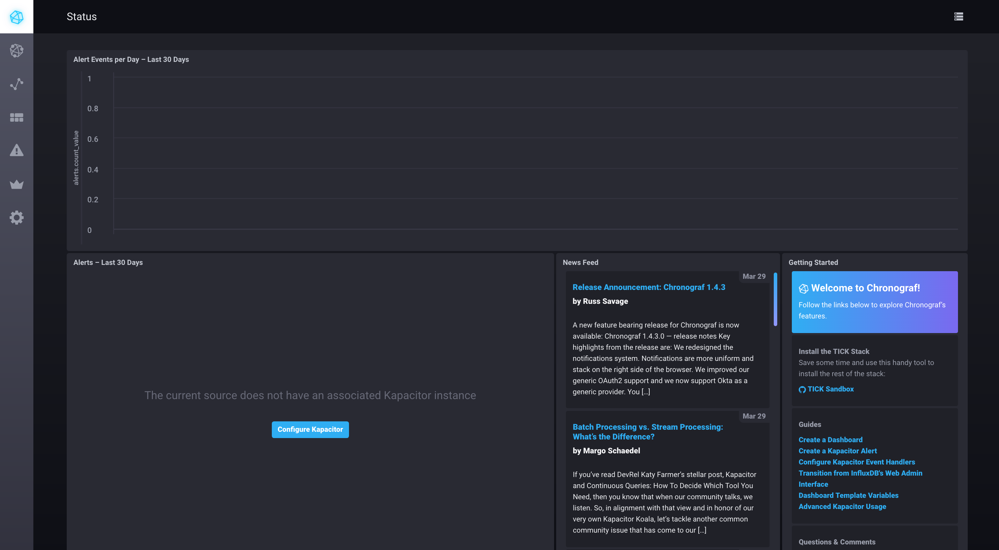

# syslog server container with rsyslog, TICK-stack and grafana

This repo combines rsyslog in server configuration with influxdata tick stack and grafana.

The components are merged from:

- [Influxdata Sandbox](https://github.com/influxdata/sandbox)
- [rsyslog rsyslog-docker](https://github.com/rsyslog/rsyslog-docker) 
- [grafana docker image](https://hub.docker.com/r/grafana/grafana)

### Running

To run the `server`, simply use docker-compose up 

To get started just run `./sandbox up`. You browser will open two tabs:

- `localhost:8888` - Chronograf's address. You will use this as a management UI for the full stack
- `localhost:3010` - Documentation server. This contains a simple markdown server for tutorials and documentation.

> NOTE: Make sure to stop any existing installations of `influxdb`, `kapacitor` or `chronograf`. If you have them running the Sandbox will run into port conflicts and fail to properly start. In this case stop the existing processes and run `./sandbox restart`. Also make sure you are **not** using _Docker Toolbox_.

Once the Sandbox launches, you should see your dashboard appear in your browser:

You are ready to get started with the TICK Stack!

Click the Host icon in the left navigation bar to see your host (named `telegraf-getting-started`) and its overall status.

You can click on `system` hyperlink to see a pre-built dashboard visualizing the basic system stats for your
host, then check out the tutorials at `http://localhost:3010/tutorials`.

If you are using the nightly builds and want to get started with Flux, make sure you check out the [Getting Started with Flux](./documentation/static/tutorials/flux-getting-started.md) tutorial.

> Note: see [influx-stress](https://github.com/influxdata/influx-stress) to create data for your Sandbox.

GLO NOTES:

testselect:

curl -G 'http://influxdb:8086/query?pretty=true' --data-urlencode "db=telegraf" --data-urlencode "q=SELECT \"message\" FROM \"telegraf\".\"autogen\".\"syslog\" WHERE  \"hostname\"='elog2'   limit 10"
